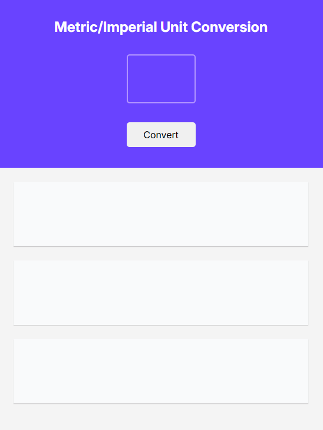
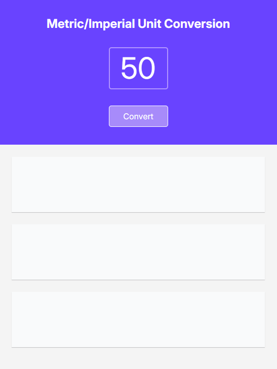
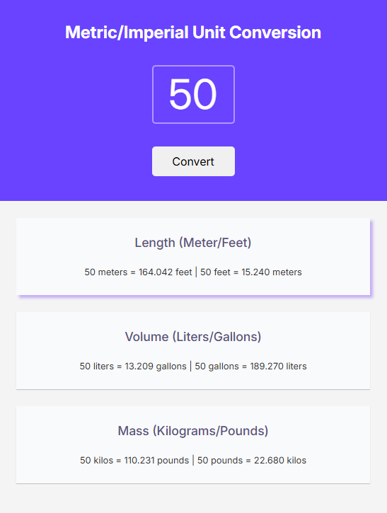

# 🔄 Unit Conversion  
**Scrimba Solo Project (PRO)**
A practical and intuitive **Unit Conversion** tool built as part of the Scrimba Frontend Career Path.  
The project focuses on practicing **JavaScript calculations**, **DOM manipulation**, and **real-time conversion logic**.
---
## 🚀 Features
- Convert between multiple unit types (length, weight, temperature, etc.)  
- Support for different measurement systems (metric, imperial)  
- Clean, user-friendly interface
  
---
## 🖼️ Preview
<p align="center">
  
  
  
</p>
---
## 🧠 What I Learned
- Creating conversion formulas for different unit types  
- Implementing real-time input validation and conversion  
- Handling input field and dynamic calculations  
- Updating the DOM to display conversion results instantly  
- Organizing conversion logic with functions  
- Styling UI elements with CSS for clarity and usability
---
## 📦 Tech Stack
- **HTML5**  
- **CSS3**  
- **JavaScript (ES6+)**  
---
## 💻 How to Use 
1. Enter a **value** in the source unit field  
2. View the **converted result** in real-time  
---
## 📁 Running Locally
1. Clone this repository:
```bash
   git clone https://github.com/hdnexus/scrimba-unit-conversion.git
```
2. Navigate to the project directory:
```bash
   cd scrimba-unit-conversion-project
```
3. Open `index.html` in your browser

Open index.html in your browser

Start converting!
